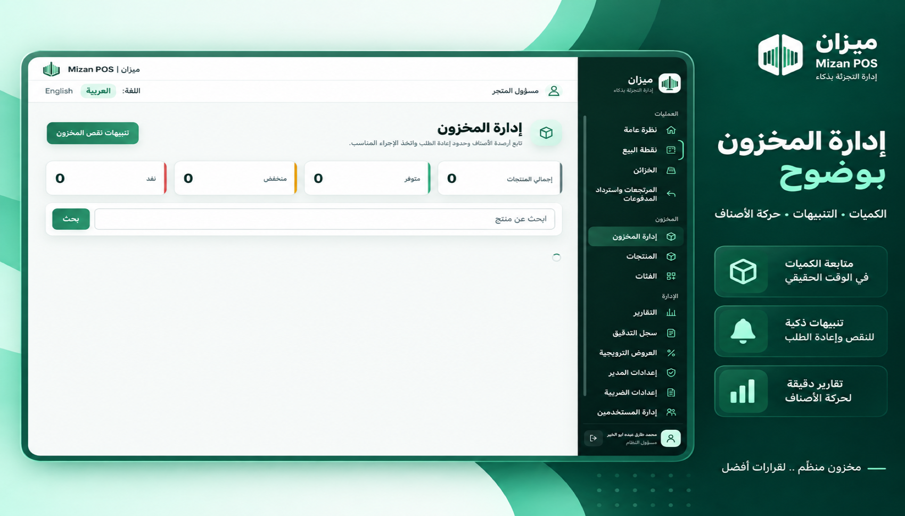
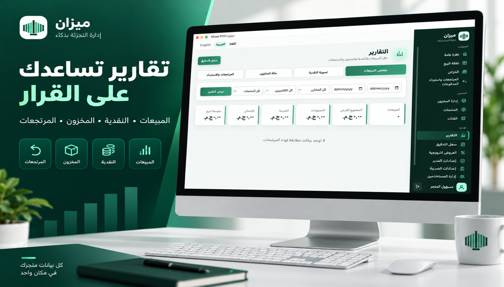

# Mizan POS — ميزان

A bilingual, modular-monolith Point-of-Sale and retail analytics system.


## Portfolio overview

Mizan is an end-to-end retail data system that turns daily supermarket operations
into reliable, analysis-ready PostgreSQL data. It demonstrates more than UI and
checkout logic: the project models the full transaction lifecycle, preserves
historical price and tax snapshots, records inventory movements, and exposes
decision-ready operational reports.

**Data and analytics highlights:**

- A normalized PostgreSQL model covering sales, line items, payments, returns,
  refunds, inventory movements, register sessions, users, and audit events.
- Business KPIs for revenue, average transaction value, discounts, tax, cash
  variance, stock health, and refund performance.
- Parameterized reporting queries with date, register, cashier, product, and
  category filters.
- Data-quality controls implemented with foreign keys, check constraints,
  immutable transaction snapshots, migrations, and automated integration tests.
- Bilingual operational dashboards that translate transactional records into
  actionable store-management information.

For the analytics-oriented case study, KPI definitions, business questions, and
data-model decisions, see
[`docs/11-data-analytics-case-study.md`](docs/11-data-analytics-case-study.md).

### Product screens

| Inventory monitoring | Operational reports |
| --- | --- |
|  |  |

## Repository structure

- `docs/` — requirements, data model, architecture, QA, operations, and the
  analytics case study.
- `backend/` — Node.js/TypeScript/Express API (Controller → Service → Repository).
- `frontend/` — React/TypeScript/Vite SPA (feature/domain-based structure).
- `desktop/` — secure Electron shell for the desktop application.
- `docker-compose.yml` — local PostgreSQL for development.

> **Status:** The core web, API, database, and standalone desktop workflows are
> implemented and tested. Final certificate-based signing and clean-device
> hardware acceptance depend on the target deployment environment.

## Prerequisites

- Node.js 20+ (tested with Node 26)
- npm
- Docker (for local PostgreSQL) — or an existing local PostgreSQL 14+ instance

## 1. Database

Start the bundled PostgreSQL container (mapped to host port **55432** to avoid
clashing with other local project databases):

```bash
docker compose up -d postgres
```

This creates database `pos_db` with user `pos_user` / password `pos_password`.
Apply the 20 versioned migrations and seed the development data:

```bash
cd backend
npm run migrate
npm run seed
```

Development accounts created by the idempotent seed:

- Admin: `admin` / `Admin123!`
- Manager: `manager` / `Manager123!`
- Cashier: `cashier` / `Cashier123!`
- Inventory Staff: `inventory` / `Inventory123!`

The seed also adds three demonstration products covering normal, low, and
out-of-stock states. Change all default passwords outside local development.

## 2. Backend

```bash
cd backend
cp .env.example .env   # adjust values if needed
npm install
npm run dev            # starts on http://localhost:4000
```

Other scripts:
- `npm run build` — TypeScript compile to `dist/`
- `npm start` — run the compiled build
- `npm test` — Jest test suite
- `npm run lint` — ESLint
- `npm run format` — Prettier write

Health check: `GET http://localhost:4000/api/health` → reports process status
and live DB connectivity.

## 3. Frontend

```bash
cd frontend
cp .env.example .env    # adjust VITE_API_BASE_URL if needed
npm install
npm run dev              # starts on http://localhost:5173
```

Other scripts:
- `npm run build` — type-check + production build
- `npm test` — Vitest suite
- `npm run lint` — ESLint
- `npm run format` — Prettier write

## 4. Desktop application

During development, keep the backend running, then launch the React client and
Electron together:

```bash
cd desktop
npm install
npm run dev
```

Packaged desktop builds use the standalone runtime by default: PostgreSQL and
the Backend start and stop with the application, so the end user does not need
Node.js, Docker, PostgreSQL, a terminal, or a manually configured database. The
Electron workspace keeps an isolated main process and preload bridge, while the
browser-based frontend remains available for development and future
central-server deployments.

## Architecture Notes

- **Backend:** modular monolith; each domain lives under
  `backend/src/modules/<domain>` with its own `*.controller.ts` /
  `*.service.ts` / `*.repository.ts` / `*.routes.ts`. Cross-cutting concerns
  (env config, DB pool, logger, error handling, auth/RBAC middleware) live
  under `backend/src/config`, `backend/src/db`, `backend/src/common`, and
  `backend/src/middleware`.
- **Frontend:** feature/domain-based structure under `frontend/src/features`,
  with shared infrastructure (API client, auth context, route guard) under
  `frontend/src/shared`.
- **Auth/RBAC:** JWT-based; every authenticated request re-fetches the live
  user status from the database rather than trusting token claims alone, so
  deactivation/role changes take effect immediately.

## Core capabilities

- Secure authentication, role-based access, and live user-status enforcement.
- Product, category, tax, promotion, and inventory management.
- Register sessions, cash reconciliation, barcode scanning, receipt printing,
  and cash-drawer integration.
- Cash, card, and split payments with guarded ambiguous-payment handling.
- Discounts, approvals, returns, proportional refunds, and immutable audit logs.
- Sales, inventory, cash-variance, and returns/refunds reporting.
- Bilingual responsive web interface and a hardened Electron desktop shell.
- Standalone desktop runtime with embedded PostgreSQL, migrations, backup,
  restore, and controlled upgrades.
- Docker-based deployment, operational runbooks, and automated integration tests.

## Current limitations

- Card processing uses a sandbox gateway adapter; no live payment processor is
  bundled.
- Publicly trusted desktop installers require owner-provided Apple and Windows
  signing certificates.
- Clean-device hardware acceptance must be completed on the target store setup.
- Independent local databases do not synchronize automatically; multi-register
  stores should use the central-server deployment model.

Detailed architecture, workflows, acceptance criteria, and operations guidance
remain available under [`docs/`](docs/) and [`ops/`](ops/README.md).
