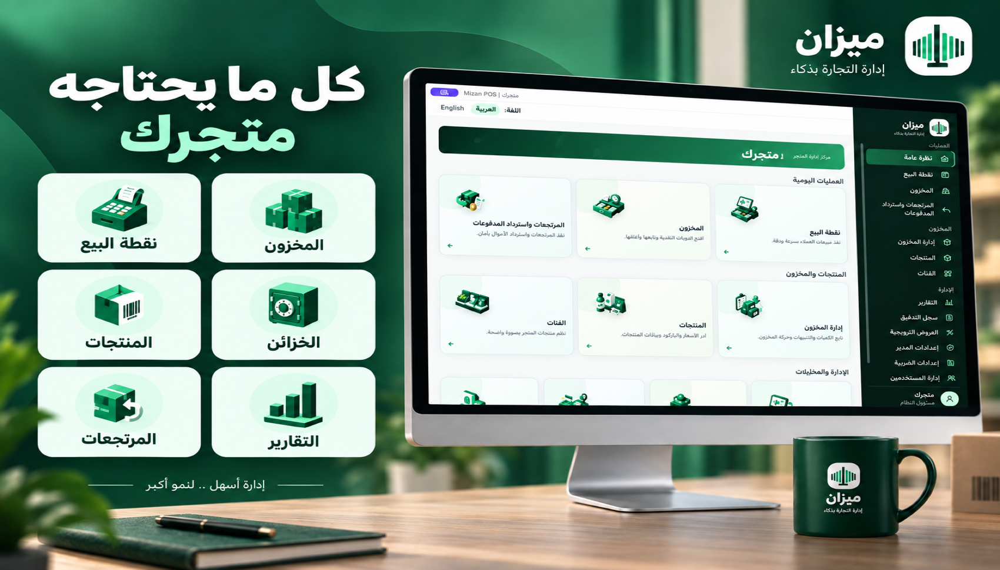

# Mizan POS — ميزان

A modular-monolith Point-of-Sale system. This repository currently contains:



## Portfolio overview

Mizan is an end-to-end retail data system that turns daily supermarket operations
into reliable, analysis-ready PostgreSQL data. It demonstrates more than UI and
checkout logic: the project models the full transaction lifecycle, preserves
historical price and tax snapshots, records inventory movements, and exposes
decision-ready operational reports.

**Data and analytics highlights:**

- A normalized PostgreSQL model covering sales, line items, payments, returns,
  refunds, inventory movements, register sessions, users, and audit events.
- Business KPIs for revenue, average transaction value, discounts, tax, cash
  variance, stock health, and refund performance.
- Parameterized reporting queries with date, register, cashier, product, and
  category filters.
- Data-quality controls implemented with foreign keys, check constraints,
  immutable transaction snapshots, migrations, and automated integration tests.
- Bilingual operational dashboards that translate transactional records into
  actionable store-management information.

For the analytics-oriented case study, KPI definitions, business questions, and
data-model decisions, see
[`docs/11-data-analytics-case-study.md`](docs/11-data-analytics-case-study.md).

## Repository structure

- `docs/` — the approved planning documents (Steps 1–6: requirements, use cases,
  business workflows, data model, backend/API architecture, UI/UX & frontend
  architecture).
- `backend/` — Node.js/TypeScript/Express API (Controller → Service → Repository).
- `frontend/` — React/TypeScript/Vite SPA (feature/domain-based structure).
- `desktop/` — secure Electron shell for the desktop application.
- `docker-compose.yml` — local PostgreSQL for development.

> **Status:** Phases 0–14 and commercial-delivery stages 15.1–15.3 are implemented:
> project foundation, authentication
> and user/RBAC administration, catalog, register sessions, and the core POS
> checkout loop, discounts/promotions, Manager approval, returns/refunds, and
> inventory operations, reports, audit-log review, responsive navigation,
> persistent browser sessions, demo data, end-to-end release verification, and
> the branded responsive **Mizan** interface.

> **Roadmap:** The original 15 implementation phases (Phase 0 through Phase 14)
> are complete. Phase 15 converts Mizan into a zero-technical-knowledge commercial
> product; 15.1–15.3 are complete and 15.4 clean-device acceptance is in progress.

## Prerequisites

- Node.js 20+ (tested with Node 26)
- npm
- Docker (for local PostgreSQL) — or an existing local PostgreSQL 14+ instance

## 1. Database

Start the bundled PostgreSQL container (mapped to host port **55432** to avoid
clashing with other local project databases):

```bash
docker compose up -d postgres
```

This creates database `pos_db` with user `pos_user` / password `pos_password`.
Apply the 20 versioned migrations and seed the development data:

```bash
cd backend
npm run migrate
npm run seed
```

Development accounts created by the idempotent seed:

- Admin: `admin` / `Admin123!`
- Manager: `manager` / `Manager123!`
- Cashier: `cashier` / `Cashier123!`
- Inventory Staff: `inventory` / `Inventory123!`

The seed also adds three demonstration products covering normal, low, and
out-of-stock states. Change all default passwords outside local development.

## 2. Backend

```bash
cd backend
cp .env.example .env   # adjust values if needed
npm install
npm run dev            # starts on http://localhost:4000
```

Other scripts:
- `npm run build` — TypeScript compile to `dist/`
- `npm start` — run the compiled build
- `npm test` — Jest test suite
- `npm run lint` — ESLint
- `npm run format` — Prettier write

Health check: `GET http://localhost:4000/api/health` → reports process status
and live DB connectivity.

## 3. Frontend

```bash
cd frontend
cp .env.example .env    # adjust VITE_API_BASE_URL if needed
npm install
npm run dev              # starts on http://localhost:5173
```

Other scripts:
- `npm run build` — type-check + production build
- `npm test` — Vitest suite
- `npm run lint` — ESLint
- `npm run format` — Prettier write

## 4. Desktop application

During development, keep the backend running, then launch the React client and
Electron together:

```bash
cd desktop
npm install
npm run dev
```

Packaged desktop builds use the standalone runtime by default: PostgreSQL and
the Backend start and stop with the application, so the end user does not need
Node.js, Docker, PostgreSQL, a terminal, or a manually configured database. The
Electron workspace keeps an isolated main process and preload bridge, while the
browser-based frontend remains available for development and future
central-server deployments.

## Architecture Notes

- **Backend:** modular monolith; each domain lives under
  `backend/src/modules/<domain>` with its own `*.controller.ts` /
  `*.service.ts` / `*.repository.ts` / `*.routes.ts`. Cross-cutting concerns
  (env config, DB pool, logger, error handling, auth/RBAC middleware) live
  under `backend/src/config`, `backend/src/db`, `backend/src/common`, and
  `backend/src/middleware`.
- **Frontend:** feature/domain-based structure under `frontend/src/features`,
  with shared infrastructure (API client, auth context, route guard) under
  `frontend/src/shared`.
- **Auth/RBAC:** JWT-based; every authenticated request re-fetches the live
  user status from the database rather than trusting token claims alone, so
  deactivation/role changes take effect immediately.

## Implemented scope

- Phase 0: Express/React foundation, health checks, PostgreSQL, logging, errors.
- Phase 1: Login, users, roles/permissions, versioned approval thresholds.
- Phase 2: Categories, products, barcode/name search, and tax configuration.
- Phase 3: Register opening/closing, cash variance, and audit events.
- Phase 4: POS cart, held sales, cash/card and split payments, completion/void,
  receipts, and stock movements.
- Phase 5: item/sale discounts, promotion priority, cashier thresholds, inline
  Manager approval, and Manager/Admin approval queue.
- Phase 6: receipted and no-receipt returns, refund thresholds and approvals,
  proportional Cash/Card refunds, restocking, and failed-refund retry.
- Phase 7: stock overview, atomic restocking and signed adjustments, immutable
  movement history, low/out-of-stock alerts, and inventory role controls.
- Phase 8: sales, cash-reconciliation, inventory, and returns/refunds reports,
  plus searchable read-only audit-log review and Manager/Admin access controls.
- Phase 9: persistent sessions, responsive role-aware navigation, demonstration
  users/catalog, full regression verification, and a live checkout-to-report
  walkthrough.
- Phase 10: Mizan visual identity, bilingual branded sign-in, role-aware command
  center, professional navigation shell, responsive layout, and consistent
  styling across forms and data tables.
- Phase 11 (complete): detailed visual and usability review of every operational
  screen, responsive QA, accessibility polish, and final UI consistency.
- Phase 12 (complete — 12.1–12.6 complete): Electron desktop application foundation, divided into six internal
  delivery stages:
  1. **12.1 — Desktop architecture and setup (complete):** Electron workspace,
     main/preload processes, development scripts, and a secure renderer
     boundary without changing the existing web application.
  2. **12.2 — Application shell and navigation (complete):** the React client
     loads inside a persistent desktop window, internal/external links are
     handled safely, window sizing and controls are available through typed
     IPC, and accidental duplicate instances are prevented.
  3. **12.3 — Secure server configuration (complete):** a bilingual first-run
     connection screen stores only the normalized API address locally, verifies
     server/database health, supplies clear offline recovery actions, and makes
     the React API client use the selected server dynamically.
  4. **12.4 — Desktop identity and launch experience (complete):** the approved
     Mizan mark now supplies PNG/macOS ICNS assets, a branded bilingual splash,
     application metadata/About details, Dock/window identity, and native
     bilingual menus with route shortcuts.
  5. **12.5 — Desktop security and resilience (complete):** context isolation,
     navigation restrictions, validated IPC contracts, OS-encrypted session
     persistence, redacted rotating logs, renderer crash recovery, React error
     recovery, and server reconnection are active.
  6. **12.6 — Desktop QA and packaging baseline (complete):** the production
     renderer loads from the secure `mizan://app` protocol without Vite; core
     operational routes were smoke-tested inside the packaged application; all
     frontend, backend, and desktop gates pass; and a verified unsigned macOS
     ARM64 DMG is available as the development delivery baseline.
- Phase 13 (complete — 13.1–13.5 implemented): POS desktop integrations and installers.
  1. **13.1 — Receipt printing (complete):** secure native print bridge,
     74 mm thermal layout, print/reprint action, browser fallback, bilingual
     printer feedback, and redacted desktop print-event logging.
  2. **13.2 — Barcode scanner (complete):** rapid USB keyboard-wedge scanning
     from anywhere on the POS screen, serialized repeated scans, safe focus
     restoration, and actionable unknown-barcode recovery in Arabic and English.
  3. **13.3 — Cash drawer (complete):** controlled ESC/POS network-printer
     pulse after an authorized captured cash payment, durable business and
     desktop event logs, bounded connection timeout, and safe cashier recovery
     without reversing a successful payment.
  4. **13.4 — Target installers (complete):** verified macOS DMG artifacts for
     Apple Silicon and Intel plus a structurally verified Windows x64 NSIS
     installer; final Windows execution acceptance remains a target-machine
     delivery check.
  5. **13.5 — Signing and updates (implementation complete):** fail-closed
     release credential checks, macOS hardened-runtime signing/notarization,
     Windows Authenticode signing, and an HTTPS signed-update flow with explicit
     download/install consent. Producing publicly trusted artifacts awaits the
     owner's Apple and Windows certificates.
- Phase 14 (implementation complete — 14.1–14.6): production readiness and
  delivery package:
  1. **14.1 Security hardening:** fail-fast production secrets, explicit CORS,
     login throttling, bounded JSON bodies, secure headers, and graceful shutdown.
  2. **14.2 Production deployment:** non-root backend image, private PostgreSQL
     network, health checks, required secrets, and migration-before-start compose.
  3. **14.3 Backup and recovery:** verified compressed backups, checksums,
     retention, guarded restore tooling, and a monthly restore-drill procedure.
  4. **14.4 Acceptance testing:** automated release gate and end-to-end bilingual
     business, security, hardware, outage, installation, and recovery UAT plan.
  5. **14.5 Operations handover:** Arabic operator guide plus production,
     monitoring, incident, rollback, and security runbook.
  6. **14.6 Pilot and delivery:** go/no-go criteria and a complete client handover
     checklist. External onsite acceptance items are explicitly tracked, not
     represented as completed without client infrastructure and approval.
- Phase 15 (in progress — 15.1–15.3 complete): commercial standalone delivery:
  1. **15.1 Local runtime engine (complete):** the installed Electron app starts
     a private embedded PostgreSQL 16 cluster and bundled Backend automatically,
     generates device-specific secrets, creates the `mizan` database, runs all
     migrations, waits for readiness, exposes services only on loopback, recovers
     through a one-click bilingual screen, and stops both processes safely. The
     existing external-server mode is retained for future multi-device stores.
  2. **15.2 First-run setup and data management (complete):** a bilingual
     four-step wizard atomically creates the store identity, secure Admin,
     roles/permissions, first register, and default tax rate. The configured
     store name appears on receipts. Admin-only manual backup/restore is
     available inside the desktop app, with daily startup backups, seven-copy
     retention, compatibility checks, confirmation, and rollback on failure.
  3. **15.3 Installer and upgrades (complete):** target-specific macOS ARM64,
     macOS Intel, and Windows x64 installers now embed only their matching
     PostgreSQL 16 runtime and fail packaging if it is absent. The stable app
     identity preserves per-user customer data, Windows creates Desktop/Start
     Menu shortcuts and leaves data on uninstall, migrations run at every
     upgraded start, controlled updates stop PostgreSQL and create a retained
     pre-upgrade backup before installation, and SHA-256 sidecars accompany all
     distributable artifacts. The migration/persistence path is exercised by an
     automated previous-schema upgrade test.
  4. **15.4 Clean-device commercial acceptance (15.4.1 complete):** the Windows
     acceptance kit contains a clean-install 0.1.0 package, a same-identity
     0.1.1 upgrade package, the current client-delivery package, Arabic
     first-run/update instructions, an evidence checklist, a machine-readable
     manifest, and verified SHA-256 checksums. Running the fresh-install,
     reboot, upgrade, uninstall/reinstall, recovery, and available-hardware
     checks on the clean Windows VM remains the active acceptance work.

The commercial single-device build now operates entirely on the customer's
computer through the standalone runtime. A central-server deployment remains
available for a future multi-device store so all tills can share one source of
truth; automatic synchronization between independent local databases is not
part of the current product.

Card processing currently uses a sandbox provider boundary. Set
`CARD_GATEWAY_MODE` to `capture`, `decline`, or `ambiguous` while developing.
An ambiguous result is stored for reconciliation and blocks another payment or
sale completion, preventing accidental double charging.

See `docs/06-ui-ux-frontend-architecture.md` for the route map, screen
inventory, and UX flows implemented by this MVP repository.

Production operations are documented in `ops/README.md`; final verification and
handover use `docs/07-acceptance-test-plan.md` through
`docs/10-pilot-delivery-checklist.md`.
