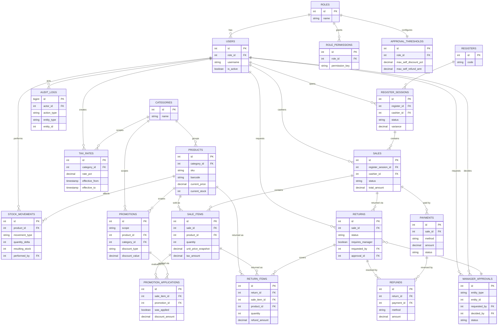

# Supermarket POS System — Data Model & Database Design

**Step 4: Data Model & Database Design**

**Conventions used in this document** (confirmed decisions):
- Stock mutations modeled as a **unified append-only ledger** (`stock_movements`) rather than separate tables per movement type.
- Cross-cutting audit modeled as a **unified generic audit log** (`audit_logs`) rather than per-domain audit tables.
- SQL/type notation is **PostgreSQL-flavored, illustrative only** — no final database technology has been chosen.
- Monetary amounts: `DECIMAL(12,2)` (EGP, no sub-piastre fractions). Stock quantities: `INTEGER` (no weighted/fractional items in MVP).
- This is a **conceptual/logical model** — no migrations, no physical implementation, no APIs, no UI.

**Ambiguity resolutions applied from this step's brief:**
Promotion precedence Product-specific > Category > General, no stacking · Tax computed post-discount · Split-payment refunds preserve original proportions · 7-day return window with receipt · No-receipt returns require Manager approval · Register variance threshold configurable by Admin · Deactivating a user blocks new operations but does not auto-force-close an open register session.

---

## 1. Entity List

Derived from all workflows (`W-01`…`W-20`) and business rules in `@/Users/mohamedtarek/Supermarket POS System/docs/03-workflows-and-business-rules.md`:

**Identity & Access**
1. `users`
2. `roles`
3. `role_permissions`
4. `approval_thresholds`

**Catalog & Pricing**
5. `categories`
6. `products`
7. `tax_rates`
8. `promotions`
9. `promotion_applications`

**Sales**
10. `registers`
11. `register_sessions`
12. `sales`
13. `sale_items`
14. `payments`

**Inventory**
15. `stock_movements`

**Returns & Refunds**
16. `returns`
17. `return_items`
18. `refunds`

**Approvals & Audit**
19. `manager_approvals`
20. `audit_logs`

*(Low-stock alerting, per `W-16`, is treated as a derived/query-time condition against `products.reorder_threshold` and current stock — not modeled as a persisted entity, since it has no independent business state beyond notification.)*

---

## 2. Entity Responsibilities

- **`users`** — every authenticated actor (Cashier, Manager, Inventory Staff, Admin). Backs `W-01` login and all attributability invariants (`INV-08`).
- **`roles`** — the four fixed MVP roles; keeps role definitions data-driven rather than hardcoded, supporting `UP-01`.
- **`role_permissions`** — maps a role to the specific sensitive actions it may perform (e.g., `apply_discount`, `approve_override`, `edit_price`), satisfying `UP-02`/`UP-03`/`UP-04` and enforcing `PR-02` (Cashier cannot edit price).
- **`approval_thresholds`** — Admin-owned numeric limits (max self-approved discount %, max self-approved refund amount) per role, with a Manager-specific ceiling set by Admin (`DS-03`, `MA-03`, `W-18`).
- **`categories`** — product grouping, used for category-scoped promotions and category-based tax rates.
- **`products`** — the sellable catalog item: current price, current stock (maintained/cached, reconciled from `stock_movements`), category, barcode/SKU, reorder threshold. Backs `W-17`, `PR-01`.
- **`tax_rates`** — Admin-configured tax rate(s), globally or per category, with an effective date range so historical sales are unaffected by later changes (`TX-01`, `TX-03`).
- **`promotions`** — configured discount campaigns with scope (`PRODUCT`, `CATEGORY`, `GENERAL`), validity window, and discount definition. Backs `W-07`, `PM-01`/`PM-02`.
- **`promotion_applications`** — records which single promotion (if any) was actually applied to a given `sale_item`, plus which competing promotions were evaluated but not selected — satisfies `PM-03`/`PM-05` (deterministic, auditable precedence) and `INV-11`.
- **`registers`** — physical/logical checkout terminals.
- **`register_sessions`** — a Cashier's open/closed shift on a register: starting cash, expected cash, counted cash, variance. Enforces `CR-01`/`INV-07` (at most one open session per register) and backs `W-02`/`W-10`.
- **`sales`** — the transaction header: status (`DRAFT`/`PAYMENT_PENDING`/`COMPLETED`/`VOIDED`), totals, register session, cashier, timestamps. Backs `W-04`/`W-09` and the Sale state machine.
- **`sale_items`** — line items with **snapshotted** unit price, discount, tax at time of sale — never mutated after `COMPLETED`, guaranteeing `INV-04`/`PR-04`.
- **`payments`** — one or more payment captures per sale (Cash/Card), each with method, amount, and status; supports split payments and the `INV-02` invariant (completed sale has valid payment).
- **`stock_movements`** — the unified, append-only ledger of every stock quantity change (sale decrement, return restock, manual addition, manual adjustment), each signed and reasoned. Backs `W-14`/`W-15`, `INV-STK-*`, `NS-*`, and traceability requirement.
- **`returns`** — a return request/decision header, optionally linked to an original `sales` row (nullable for no-receipt case), with status (`REQUESTED`/`APPROVED`/`REFUNDED`/`REJECTED`). Backs `W-11`/`W-12`, `RT-*`.
- **`return_items`** — which original `sale_items` (and quantities) are being returned, enforcing `RT-04` (cannot over-return).
- **`refunds`** — the actual money movement(s) reversing a return, potentially split across methods to mirror original payment proportions (`RF-01`/`RF-02`).
- **`manager_approvals`** — a generic escalation/decision record (Pending/Approved/Denied) referenced polymorphically by discount overrides, no-receipt returns, and voids-after-payment. Backs `W-08`, `MA-*`, `INV-09`.
- **`audit_logs`** — the generic, immutable, append-only record of every sensitive operation system-wide, satisfying `AL-*`/`INV-06`.

---

## 3. Relationship / Cardinality Model

- `roles` **1:N** `users` — each user has exactly one role (`UP-01`).
- `roles` **1:N** `role_permissions` — each role has many permission grants.
- `roles` **1:N** `approval_thresholds` — each role has one threshold configuration (effectively 1:1 per role, modeled as 1:N to allow future history/versioning).
- `categories` **1:N** `products` — a product belongs to zero-or-one category (nullable FK) or exactly one, per catalog policy (see Open Question).
- `categories` **1:N** `tax_rates` — tax rate may be category-scoped (nullable FK; null = global rate).
- `categories` **1:N** `promotions` — promotion may be category-scoped (nullable FK, mutually consistent with `scope` enum).
- `products` **1:N** `promotions` — promotion may be product-scoped (nullable FK, mutually consistent with `scope` enum).
- `products` **1:N** `sale_items` — a product appears on many sale line items across time.
- `products` **1:N** `stock_movements` — every stock change references exactly one product.
- `registers` **1:N** `register_sessions` — a register has many sessions over time, but at most one **Open** at a time (`CR-01`).
- `users` **1:N** `register_sessions` — a Cashier opens many sessions over time.
- `register_sessions` **1:N** `sales` — all sales in a session are attributed to that session/cashier.
- `sales` **1:N** `sale_items` — a sale has one or more line items.
- `sales` **1:N** `payments` — a sale has one or more payments (split payment support).
- `sale_items` **1:N** `promotion_applications` — a line item has zero-or-one *applied* promotion record but may have multiple *evaluated* records (won=true/false) — see schema note.
- `promotions` **1:N** `promotion_applications` — a promotion may be evaluated/applied across many sale items.
- `sales` **1:N** `returns` — a completed sale may have multiple partial returns over time (nullable FK for no-receipt returns).
- `returns` **1:N** `return_items` — a return covers one or more original line items.
- `sale_items` **1:N** `return_items` — a line item may be partially returned multiple times (cumulative quantity constrained by `RT-04`).
- `returns` **1:N** `refunds` — a return's refund may be split across methods (mirroring original payment proportions).
- `payments` **1:N** `refunds` — each refund-split references which original payment it reverses (nullable, since no-receipt returns have no original payment to reference).
- `users` **1:N** `manager_approvals` (as approver) — a Manager/Admin decides many approval requests.
- `users` **1:N** `manager_approvals` (as requester) — a Cashier raises many approval requests.
- `manager_approvals` **1:1 (optional)** →  polymorphic link from `sales` (void), `returns` (no-receipt), or a discount-application context — modeled via `entity_type` + `entity_id` (see Design Decisions, §10, on polymorphic references).
- `users` **1:N** `audit_logs` — every audit record is attributed to exactly one acting user.
- `audit_logs` polymorphically references any entity via `entity_type` + `entity_id`.

---

## 4. Detailed Schema Proposal

> Notation: `PK` = primary key, `FK` = foreign key, `UQ` = unique, `NN` = not null (all `PK`/`FK` are implicitly `NN` unless marked nullable). Types are illustrative (PostgreSQL-flavored).

### 4.1 Identity & Access

```sql
-- roles: fixed MVP set (CASHIER, MANAGER, INVENTORY_STAFF, ADMIN)
roles
  id              SERIAL PK
  name            VARCHAR(30)   NN UQ   -- 'CASHIER' | 'MANAGER' | 'INVENTORY_STAFF' | 'ADMIN'
  created_at      TIMESTAMPTZ   NN DEFAULT now()

users
  id              SERIAL PK
  role_id         INTEGER       NN FK -> roles.id
  username        VARCHAR(50)   NN UQ
  password_hash   VARCHAR(255)  NN
  full_name       VARCHAR(100)  NN
  is_active       BOOLEAN       NN DEFAULT true   -- deactivation flag (blocks new ops, does NOT force-close sessions)
  created_at      TIMESTAMPTZ   NN DEFAULT now()
  deactivated_at  TIMESTAMPTZ   NULL

role_permissions
  id              SERIAL PK
  role_id         INTEGER       NN FK -> roles.id
  permission_key  VARCHAR(60)   NN   -- e.g. 'apply_discount','approve_override','edit_price','manage_users'
  UNIQUE (role_id, permission_key)

approval_thresholds
  id                    SERIAL PK
  role_id               INTEGER       NN FK -> roles.id  UQ  -- one active config per role (versioning via effective_from if needed later)
  max_self_discount_pct DECIMAL(5,2)  NN DEFAULT 0 CHECK (max_self_discount_pct >= 0 AND max_self_discount_pct <= 100)
  max_self_refund_amt   DECIMAL(12,2) NN DEFAULT 0 CHECK (max_self_refund_amt >= 0)
  register_variance_alert_threshold DECIMAL(12,2) NN DEFAULT 0 CHECK (register_variance_alert_threshold >= 0)
  updated_by            INTEGER       NN FK -> users.id
  updated_at            TIMESTAMPTZ   NN DEFAULT now()
```

### 4.2 Catalog & Pricing

```sql
categories
  id              SERIAL PK
  name            VARCHAR(80)   NN UQ

products
  id                  SERIAL PK
  category_id         INTEGER       NULL FK -> categories.id
  sku                 VARCHAR(50)   NN UQ
  barcode             VARCHAR(50)   NULL UQ
  name                VARCHAR(150)  NN
  current_price       DECIMAL(12,2) NN CHECK (current_price >= 0)
  current_stock       INTEGER       NN DEFAULT 0 CHECK (current_stock >= 0)   -- cached/reconciled from stock_movements
  reorder_threshold   INTEGER       NN DEFAULT 0 CHECK (reorder_threshold >= 0)
  is_active           BOOLEAN       NN DEFAULT true   -- soft-delete/discontinue, preserves historical FK integrity
  created_at          TIMESTAMPTZ   NN DEFAULT now()
  updated_at           TIMESTAMPTZ   NN DEFAULT now()

tax_rates
  id              SERIAL PK
  category_id     INTEGER       NULL FK -> categories.id   -- null = global/default rate
  rate_pct        DECIMAL(5,2)  NN CHECK (rate_pct >= 0)
  effective_from  TIMESTAMPTZ   NN
  effective_to    TIMESTAMPTZ   NULL    -- null = currently active
  created_by      INTEGER       NN FK -> users.id   -- Admin only, enforced at application layer (TX-01)

promotions
  id              SERIAL PK
  name            VARCHAR(100)  NN
  scope           VARCHAR(20)   NN CHECK (scope IN ('PRODUCT','CATEGORY','GENERAL'))
  product_id      INTEGER       NULL FK -> products.id     -- set iff scope = 'PRODUCT'
  category_id     INTEGER       NULL FK -> categories.id   -- set iff scope = 'CATEGORY'
  discount_type   VARCHAR(10)   NN CHECK (discount_type IN ('PERCENT','FIXED'))
  discount_value  DECIMAL(12,2) NN CHECK (discount_value >= 0)
  valid_from      TIMESTAMPTZ   NN
  valid_to        TIMESTAMPTZ   NN
  is_active       BOOLEAN       NN DEFAULT true
  CHECK (
    (scope = 'PRODUCT'  AND product_id  IS NOT NULL AND category_id IS NULL) OR
    (scope = 'CATEGORY' AND category_id IS NOT NULL AND product_id  IS NULL) OR
    (scope = 'GENERAL'  AND product_id  IS NULL      AND category_id IS NULL)
  )
  CHECK (valid_to > valid_from)

promotion_applications
  id              SERIAL PK
  sale_item_id    INTEGER       NN FK -> sale_items.id
  promotion_id    INTEGER       NN FK -> promotions.id
  was_applied     BOOLEAN       NN   -- true = this is the single winning promotion (PM-03); false = evaluated-but-not-selected, retained for audit (PM-05)
  discount_amount DECIMAL(12,2) NN CHECK (discount_amount >= 0)
  precedence_rank INTEGER       NN   -- 1=PRODUCT, 2=CATEGORY, 3=GENERAL — snapshot of rule used
  created_at      TIMESTAMPTZ   NN DEFAULT now()
  UNIQUE (sale_item_id, promotion_id)
```

### 4.3 Registers & Sales

```sql
registers
  id              SERIAL PK
  code            VARCHAR(20)   NN UQ
  is_active       BOOLEAN       NN DEFAULT true

register_sessions
  id                  SERIAL PK
  register_id         INTEGER       NN FK -> registers.id
  cashier_id          INTEGER       NN FK -> users.id
  status              VARCHAR(10)   NN CHECK (status IN ('OPEN','CLOSED'))
  starting_cash       DECIMAL(12,2) NN CHECK (starting_cash >= 0)
  expected_cash       DECIMAL(12,2) NULL   -- computed at close time
  counted_cash        DECIMAL(12,2) NULL   -- entered by cashier at close time
  variance            DECIMAL(12,2) NULL   -- counted_cash - expected_cash
  variance_threshold_snapshot DECIMAL(12,2) NULL  -- Admin-configured threshold at time of close (audit-safe, CR-04)
  opened_at           TIMESTAMPTZ   NN DEFAULT now()
  closed_at           TIMESTAMPTZ   NULL
  closed_by           INTEGER       NULL FK -> users.id   -- differs from cashier_id on Manager force-close
  -- CR-01 / INV-07 enforced via partial unique index, see §5 Constraints

sales
  id                  SERIAL PK
  register_session_id INTEGER       NN FK -> register_sessions.id
  cashier_id          INTEGER       NN FK -> users.id
  status              VARCHAR(16)   NN CHECK (status IN ('DRAFT','PAYMENT_PENDING','COMPLETED','VOIDED'))
  subtotal_amount     DECIMAL(12,2) NN DEFAULT 0 CHECK (subtotal_amount >= 0)
  discount_amount     DECIMAL(12,2) NN DEFAULT 0 CHECK (discount_amount >= 0)
  tax_amount          DECIMAL(12,2) NN DEFAULT 0 CHECK (tax_amount >= 0)
  total_amount        DECIMAL(12,2) NN DEFAULT 0 CHECK (total_amount >= 0)
  created_at          TIMESTAMPTZ   NN DEFAULT now()
  completed_at        TIMESTAMPTZ   NULL
  voided_at           TIMESTAMPTZ   NULL
  voided_by           INTEGER       NULL FK -> users.id
  CHECK (status <> 'COMPLETED' OR completed_at IS NOT NULL)
  CHECK (status <> 'VOIDED' OR voided_at IS NOT NULL)

sale_items
  id                  SERIAL PK
  sale_id             INTEGER       NN FK -> sales.id
  product_id          INTEGER       NN FK -> products.id
  quantity             INTEGER       NN CHECK (quantity > 0)
  unit_price_snapshot DECIMAL(12,2) NN CHECK (unit_price_snapshot >= 0)   -- PR-03, immutable post-completion (PR-04/INV-04)
  discount_amount     DECIMAL(12,2) NN DEFAULT 0 CHECK (discount_amount >= 0)
  tax_rate_snapshot   DECIMAL(5,2)  NN DEFAULT 0 CHECK (tax_rate_snapshot >= 0)   -- TX-02/TX-03
  tax_amount          DECIMAL(12,2) NN DEFAULT 0 CHECK (tax_amount >= 0)
  line_total          DECIMAL(12,2) NN CHECK (line_total >= 0)
  CHECK (discount_amount <= unit_price_snapshot * quantity)

payments
  id              SERIAL PK
  sale_id         INTEGER       NN FK -> sales.id
  method          VARCHAR(10)   NN CHECK (method IN ('CASH','CARD'))
  amount          DECIMAL(12,2) NN CHECK (amount > 0)
  status          VARCHAR(12)   NN CHECK (status IN ('CAPTURED','FAILED','REVERSED'))
  captured_at     TIMESTAMPTZ   NN DEFAULT now()
  reversed_at     TIMESTAMPTZ   NULL   -- set when a void reverses a provisional capture (VD-03)
```

### 4.4 Inventory

```sql
stock_movements
  id              SERIAL PK
  product_id      INTEGER       NN FK -> products.id
  movement_type   VARCHAR(20)   NN CHECK (movement_type IN ('SALE','RETURN_RESTOCK','MANUAL_ADD','MANUAL_ADJUST'))
  quantity_delta  INTEGER       NN CHECK (quantity_delta <> 0)   -- signed: negative for SALE, positive for restock/add, either sign for MANUAL_ADJUST
  resulting_stock INTEGER       NN CHECK (resulting_stock >= 0)  -- snapshot of stock AFTER this movement (NS-01 enforced at write time)
  reference_type  VARCHAR(20)   NN CHECK (reference_type IN ('SALE_ITEM','RETURN_ITEM','MANUAL'))
  reference_id    INTEGER       NULL   -- polymorphic; null only for MANUAL type
  reason          VARCHAR(255)  NULL   -- mandatory at application layer for MANUAL_ADJUST (W-15)
  performed_by    INTEGER       NN FK -> users.id
  created_at      TIMESTAMPTZ   NN DEFAULT now()
  CHECK (movement_type <> 'MANUAL_ADJUST' OR reason IS NOT NULL)
```

### 4.5 Returns & Refunds

```sql
returns
  id                  SERIAL PK
  sale_id             INTEGER       NULL FK -> sales.id   -- null = no-receipt return
  status              VARCHAR(10)   NN CHECK (status IN ('REQUESTED','APPROVED','REFUNDED','REJECTED'))
  reason              VARCHAR(255)  NN
  requires_manager    BOOLEAN       NN   -- true if sale_id IS NULL (no-receipt, always) OR amount exceeds cashier threshold
  requested_by        INTEGER       NN FK -> users.id
  approval_id         INTEGER       NULL FK -> manager_approvals.id
  requested_at        TIMESTAMPTZ   NN DEFAULT now()
  decided_at          TIMESTAMPTZ   NULL
  CHECK (sale_id IS NOT NULL OR requires_manager = true)   -- no-receipt returns always require Manager (RT-02)

return_items
  id                  SERIAL PK
  return_id           INTEGER       NN FK -> returns.id
  sale_item_id        INTEGER       NULL FK -> sale_items.id   -- null for no-receipt (no original line to reference)
  product_id          INTEGER       NN FK -> products.id       -- always known, even without receipt
  quantity             INTEGER       NN CHECK (quantity > 0)
  refund_amount        DECIMAL(12,2) NN CHECK (refund_amount >= 0)
  -- RT-04 (no over-returning) enforced at application layer: SUM(quantity) for a given sale_item_id <= original sale_item.quantity

refunds
  id                  SERIAL PK
  return_id           INTEGER       NN FK -> returns.id
  payment_id          INTEGER       NULL FK -> payments.id   -- which original payment this split reverses; null for no-receipt (cash-only, RF-02)
  method              VARCHAR(10)   NN CHECK (method IN ('CASH','CARD'))
  amount              DECIMAL(12,2) NN CHECK (amount > 0)
  status              VARCHAR(12)   NN CHECK (status IN ('COMPLETED','FAILED'))
  processed_at        TIMESTAMPTZ   NN DEFAULT now()
  -- RF-01: sum of refunds.amount per payment_id proportionally mirrors payments.amount split
  -- RF-03: enforced at application layer against SUM(refunds.amount) per original sale <= SUM(payments.amount)
```

### 4.6 Approvals & Audit

```sql
manager_approvals
  id              SERIAL PK
  entity_type     VARCHAR(30)   NN CHECK (entity_type IN ('DISCOUNT','RETURN_NO_RECEIPT','RETURN_WITH_RECEIPT','VOID_AFTER_PAYMENT'))
  entity_id       INTEGER       NN   -- polymorphic reference (sale_id, return_id, etc. depending on entity_type)
  requested_by    INTEGER       NN FK -> users.id
  status          VARCHAR(10)   NN CHECK (status IN ('PENDING','APPROVED','DENIED'))
  decided_by      INTEGER       NULL FK -> users.id   -- Manager/Admin; null while PENDING
  amount_context  DECIMAL(12,2) NULL   -- discount/refund amount under review, for reporting
  requested_at    TIMESTAMPTZ   NN DEFAULT now()
  decided_at      TIMESTAMPTZ   NULL
  CHECK (status = 'PENDING' OR (decided_by IS NOT NULL AND decided_at IS NOT NULL))

audit_logs
  id              BIGSERIAL PK
  actor_id        INTEGER       NN FK -> users.id
  action_type     VARCHAR(50)   NN   -- e.g. 'SALE_COMPLETED','VOID','PRICE_CHANGE','PERMISSION_CHANGE','REGISTER_CLOSE'
  entity_type     VARCHAR(30)   NN   -- e.g. 'SALE','PRODUCT','USER','REGISTER_SESSION','RETURN'
  entity_id       INTEGER       NN
  reason          VARCHAR(255)  NULL
  before_snapshot JSONB         NULL
  after_snapshot  JSONB         NULL
  created_at      TIMESTAMPTZ   NN DEFAULT now()
  -- append-only: no UPDATE/DELETE permitted at application layer (AL-03)
```

---

## 5. Constraints

### Unique Constraints
- `users.username`
- `products.sku`; `products.barcode` (nullable-unique — multiple NULLs allowed, non-null values must be unique)
- `categories.name`
- `registers.code`
- `roles.name`
- `role_permissions (role_id, permission_key)` composite
- `promotion_applications (sale_item_id, promotion_id)` composite
- `approval_thresholds.role_id`
- **Partial unique index:** `register_sessions (register_id) WHERE status = 'OPEN'` — enforces `CR-01`/`INV-07` (at most one open session per register) at the database level, not just application logic.

### NOT NULL Constraints
- All primary keys, all foreign keys (unless explicitly marked nullable per schema above).
- All monetary/quantity columns central to totals: `sales.total_amount`, `sale_items.unit_price_snapshot`, `sale_items.line_total`, `payments.amount`, `stock_movements.quantity_delta`, `refunds.amount`.
- All actor/attribution columns: `audit_logs.actor_id`, `stock_movements.performed_by`, `sales.cashier_id`, `manager_approvals.requested_by` — directly enforces `INV-08`.
- `stock_movements.resulting_stock` — always recorded, never inferred lazily, so `NS-01` is checkable per-row.

### CHECK Constraints (summary — see inline SQL above for full detail)
- Non-negativity: `products.current_stock >= 0`, `stock_movements.resulting_stock >= 0`, all money columns `>= 0`.
- Enum-style status columns constrained to their valid state-machine values (`sales.status`, `returns.status`, `register_sessions.status`, `payments.status`, `refunds.status`, `manager_approvals.status`).
- `sales`: `completed_at`/`voided_at` populated consistently with `status` (prevents a `COMPLETED` sale from missing its completion timestamp).
- `sale_items.discount_amount <= unit_price_snapshot * quantity` — a line's discount can never exceed its own value (`DS-02`).
- `promotions`: scope/FK consistency check (exactly one of `product_id`/`category_id` set, matching `scope`) and `valid_to > valid_from`.
- `stock_movements`: `MANUAL_ADJUST` requires a non-null `reason` (`W-15` mandatory reason rule).
- `returns`: no-receipt (`sale_id IS NULL`) implies `requires_manager = true` (`RT-02`).
- `manager_approvals`: non-`PENDING` status requires both `decided_by` and `decided_at` populated (`MA-04`).

### Application-Layer Constraints (not practically expressible as a single-row DB `CHECK`, but essential invariants)
- `RT-04`: cumulative `return_items.quantity` for a given `sale_item_id` must never exceed that `sale_item`'s original `quantity`.
- `RF-03`: cumulative `refunds.amount` linked (directly or via `returns.sale_id`) to an original sale must never exceed that sale's total paid amount.
- `RF-01`: refund split proportions across `payments` must mirror the original payment method proportions for receipted returns.
- `INV-STK-03`/`NS-01` at the moment of sale completion: verified by re-checking `products.current_stock` (or summing `stock_movements`) immediately before inserting the `SALE`-type movement rows, inside the same transaction as sale completion (see §8 Concurrency).
- `PM-03`/`PM-04`: exactly one `promotion_applications.was_applied = true` row per `sale_item_id` — enforceable via a partial unique index (`UNIQUE (sale_item_id) WHERE was_applied = true`), which *is* DB-expressible and should be added.

---

## 6. Indexing Strategy

Indexes chosen to support the highest-frequency POS operations:

| Index | Purpose |
|---|---|
| `products (barcode)` | Barcode scan lookup at checkout (`W-03`) — highest-frequency read in the system. |
| `products (sku)` | Manual SKU search fallback. |
| `products (name)` (trigram/full-text if supported) | Manual product search by name. |
| `products (category_id)` | Category-scoped promotion/tax lookups. |
| `sale_items (product_id)` | Sales-by-product reporting; also used when computing current stock if derived rather than cached. |
| `sales (register_session_id)` | Register-session reconciliation, `CR-03` (checking no open sales remain at close). |
| `sales (cashier_id, created_at)` | Cashier performance / per-shift reporting (`W-20`). |
| `sales (status)` | Quickly finding all `DRAFT`/`PAYMENT_PENDING` sales (e.g., held transactions, or session-close validation). |
| `stock_movements (product_id, created_at)` | Stock history per product, current-stock reconciliation, low-stock trend analysis. |
| `stock_movements (reference_type, reference_id)` | Traceability: "what stock movement resulted from this sale_item/return_item?" |
| `register_sessions (register_id) WHERE status='OPEN'` | Already listed as unique index in §5; also serves as the fast lookup path for "is this register open?" |
| `returns (sale_id)` | Finding all returns against a given original sale (refundable-balance calculation, `RF-03`). |
| `manager_approvals (status)` | Fast lookup of `PENDING` approvals for Manager dashboards. |
| `audit_logs (entity_type, entity_id)` | Audit trail lookup for a specific entity ("show me everything that happened to Sale #123"). |
| `audit_logs (actor_id, created_at)` | Per-user activity audit/reporting. |
| `tax_rates (category_id, effective_from, effective_to)` | Resolving the applicable tax rate at a given point in time. |
| `promotions (scope, product_id, category_id, valid_from, valid_to) WHERE is_active` | Fast lookup of currently-eligible promotions at checkout time. |

---

## 7. Audit / History Strategy

- **Historical sale accuracy (`INV-04`/`PR-04`/`TX-03`):** `sale_items` stores `unit_price_snapshot`, `discount_amount`, and `tax_rate_snapshot`/`tax_amount` as **immutable, write-once** values captured at the moment the line item is finalized. Application logic must forbid any `UPDATE` to these columns once the parent `sales.status = 'COMPLETED'`. Later changes to `products.current_price`, `promotions`, or `tax_rates` never touch existing `sale_items` rows.
- **Voided sales remain auditable (`VD` rules):** a `VOIDED` sale is never deleted — its row, line items, and any (reversed) payments persist with `status = 'VOIDED'` and `voided_by`/`voided_at` populated, plus a corresponding `audit_logs` entry. Reporting queries must explicitly filter by status rather than relying on row absence.
- **Generic audit log (`audit_logs`):** every sensitive operation enumerated in `AL-01` writes exactly one row here, in the same transaction as the operation itself (see §8 boundaries). The table is **append-only** — no application code path performs `UPDATE` or `DELETE` on it (`AL-03`). `before_snapshot`/`after_snapshot` JSONB columns capture enough context to reconstruct "what changed" without needing a separate typed table per action type, at the cost of weaker query typing (see Risks, §11).
- **Stock ledger as history (`stock_movements`):** every stock-affecting action, regardless of source, is an append-only row; `products.current_stock` is a **maintained/cached** value updated transactionally alongside each new movement row (not purely computed on-read), balancing query performance with the ledger's authoritative history. Periodic reconciliation (sum of `stock_movements.quantity_delta` should equal `products.current_stock`) is a recommended operational integrity check.
- **Approval accountability (`manager_approvals`):** every escalation, regardless of outcome (Approved/Denied), is retained permanently — denied requests are not deleted, preserving a full record of overridden vs. rejected sensitive actions.
- **Permission/threshold history:** `approval_thresholds` and `role_permissions` changes are tracked via `audit_logs` (action_type `PERMISSION_CHANGE`/`THRESHOLD_CHANGE`) rather than dedicated versioned tables in MVP — sufficient for accountability without over-engineering; see Open Question §12 on whether full point-in-time threshold versioning is needed later.

---

## 8. Concurrency Considerations

- **Last-unit-of-stock race (`CC-01`/`CC-02`):** two register sessions completing a sale for the same product simultaneously must not both succeed if combined quantity would drive stock negative. At the logical level, this requires the "read current stock → validate → write new stock_movement + update cached stock" sequence to be a single atomic, serializable unit per product (e.g., row-level lock on the `products` row, or an equivalent conditional/atomic decrement guarded by `CHECK (current_stock >= 0)` that causes the transaction to fail and be retried). This is called out here as a **business requirement on the eventual implementation**, not a specific database technology choice.
- **Register session uniqueness (`CR-01`/`INV-07`):** enforced declaratively via the partial unique index on `register_sessions (register_id) WHERE status='OPEN'` (§5) — this is inherently concurrency-safe at the database level (a second concurrent "open" attempt will fail the unique constraint rather than relying on an application-level check-then-insert, which would be race-prone).
- **Sale completion atomicity (`INV-02`, boundary #1 from Step 3):** the combination of (a) re-validating stock, (b) inserting `stock_movements` rows, (c) updating `products.current_stock`, (d) finalizing `payments`, (e) updating `sales.status`, and (f) writing the `audit_logs` row must occur within one all-or-nothing unit of work.
- **Refund/return atomicity:** approving a return, issuing the refund(s), and restocking (if applicable) must likewise be treated as one unit — a partial failure (e.g., refund succeeds but restock fails) would violate traceability and financial-consistency invariants.
- **Permission/threshold immediacy (`UP-05`):** because `approval_thresholds`/`role_permissions` are read fresh on each sensitive-operation check (not cached long-term in a session token), no special concurrency handling is needed beyond standard read-committed consistency — a change becomes visible to the very next read.
- **Audit log append-only concurrency:** since `audit_logs` is insert-only with no cross-row invariant (each row is independent), high-concurrency inserts from multiple registers are not a contention risk beyond standard write throughput.

---

## 9. ERD (Mermaid Notation)



---

## 10. Explanation of Important Design Decisions

- **Unified `stock_movements` ledger instead of per-type tables:** every stock change (sale, restock, adjustment, return-restock) is structurally identical (a signed quantity delta against a product, with an actor and reason). A single ledger table gives one authoritative place to reconstruct history, sum current stock for reconciliation, and audit any discrepancy, at the cost of a `movement_type` discriminator and slightly weaker per-type column typing (e.g., `reason` is only meaningful for `MANUAL_ADJUST`).
- **`products.current_stock` as a maintained/cached column, not purely derived:** checkout-time stock checks (`W-04`) are extremely latency-sensitive; summing potentially thousands of ledger rows per product on every scan would not scale well. The cached column is updated transactionally with every new `stock_movements` row, and the ledger remains the reconcilable source of truth if the cache ever drifts.
- **`sale_items` snapshot columns instead of joining to `products`/`promotions`/`tax_rates` at read time:** this is the single most important decision for satisfying `INV-04` (historical price immutability). If historical totals were computed by joining to current catalog/tax/promotion data, any later price or tax change would silently rewrite history. Snapshotting at write time makes the "completed sale" a fully self-contained, immutable record.
- **Generic `audit_logs` table over per-domain audit tables:** chosen per your confirmed preference — trades some query type-safety (JSONB `before`/`after` snapshots vs. strongly-typed columns) for a single consistent audit mechanism across all ~10 sensitive operation types, avoiding duplicated audit-table boilerplate across the schema.
- **Polymorphic references (`manager_approvals.entity_type/entity_id`, `audit_logs.entity_type/entity_id`, `stock_movements.reference_type/reference_id`):** necessary because a single approval/audit/movement mechanism must attach to several unrelated entity types (sales, returns, discounts). The tradeoff is the loss of a DB-enforced foreign key on these polymorphic columns — referential integrity for these must be enforced at the application layer (see Risks, §11).
- **Nullable `returns.sale_id`:** models the no-receipt return case directly (rather than a sentinel row), making the "no original sale" condition explicit and query-friendly (`WHERE sale_id IS NULL`).
- **`promotion_applications` retains non-winning evaluations (`was_applied = false`):** directly satisfies `PM-05` (audit which competing promotions were considered) without needing a separate log table, since precedence disputes/customer questions ("why didn't my other discount apply?") are a realistic support scenario.
- **Partial unique index for open register sessions:** enforces the single-most-critical register invariant (`CR-01`) at the database level rather than trusting application code's check-then-insert logic, which is inherently race-prone under concurrent register-open attempts.
- **Soft-delete via `is_active` on `products`/`registers`/`promotions` rather than hard delete:** preserves referential integrity for historical `sale_items`, `stock_movements`, and `promotion_applications` rows that reference these entities — a deleted product must never orphan historical sales data.

---

## 11. Potential Design Risks

- **Generic `audit_logs` JSONB snapshots** sacrifice queryability/type safety compared to per-domain typed audit tables — complex audit queries (e.g., "show all price changes greater than 10%") require JSONB parsing rather than simple column comparisons. Acceptable tradeoff for MVP breadth, but worth revisiting if audit reporting needs grow sophisticated.
- **Polymorphic FKs (`entity_type`/`entity_id` pattern)** used in `manager_approvals`, `audit_logs`, and `stock_movements.reference_type/reference_id` cannot be enforced by the database's native foreign-key mechanism — referential integrity (e.g., ensuring `entity_id` actually exists in the referenced table) is an application-layer responsibility, and a bug there could silently create orphaned/incorrect references.
- **Cached `products.current_stock` drift risk:** if any code path updates stock without also writing a `stock_movements` row (or vice versa), the cache and ledger diverge. Requires strict discipline that all stock mutations go through a single code path, plus periodic reconciliation jobs.
- **`approval_thresholds` modeled as one active row per role** (no built-in history/versioning) — if the business later needs "what was the threshold on this exact past date" for a compliance audit, this schema alone won't answer that; only the `audit_logs` trail would (indirectly, via reconstructed snapshots).
- **Split-payment refund proportioning logic (`RF-01`)** is expressed as an application-layer rule against `refunds`/`payments`, not a DB constraint — a coding error could violate proportionality without the database catching it directly (though `RF-03`'s sum-cap is more directly enforceable).
- **`promotion_applications` write volume:** for transactions with many line items and many active promotions, retaining every evaluated-but-not-applied promotion row could grow this table significantly faster than actual "applied" discounts — worth monitoring at scale, though acceptable for a single-store MVP.
- **Last-unit stock race handling** depends entirely on the eventual implementation choosing an appropriate concurrency control mechanism (row locking, optimistic retry, or serializable transactions) — this document specifies the *requirement*, not the *mechanism*, which is intentionally deferred, but is a real risk if implemented naively (e.g., non-atomic read-then-write).

---

## 12. Questions to Resolve Before Implementation

1. **Is `products.category_id` mandatory or optional?** The schema currently allows `NULL` (uncategorized products). Should every product be required to belong to a category (affects category-scoped tax/promotion completeness)?
2. **Approval threshold versioning:** Is a single "current threshold per role" sufficient for MVP, or does the business need point-in-time historical threshold values retrievable later (would require a versioned/effective-dated table instead of one row per role)?
3. **Barcode uniqueness across inactive/discontinued products:** If a product is deactivated, can its barcode be reused by a brand-new product, or must barcodes remain globally unique forever (affects the nullable-unique index behavior and whether `is_active` should be part of the uniqueness scope)?
4. **Refund proportional-split rounding:** When splitting a refund proportionally across original cash/card amounts, how should rounding remainders (EGP fractions) be resolved deterministically (e.g., remainder assigned to cash) to avoid a refund total that's off by a piastre from the target amount?
5. **7-day return window edge case:** Is the window calculated from the sale's `completed_at` timestamp, or a separate "purchase date" concept — and is it exactly 7×24 hours or calendar-day-based (matters for late-evening edge cases)?
6. **Multi-store extensibility placeholder:** Should a nullable `store_id` column be pre-added now (unused, defaulted to a single row) on entities like `registers`, `sales`, `users` to ease future multi-store migration, or is that premature per the "do not over-engineer" constraint? (Current design assumes implicit single-store and adds no such column.)
7. **`reference_id` polymorphic type consistency:** For `stock_movements.reference_type = 'MANUAL'`, `reference_id` is null — should there instead be a self-referencing "manual movement reason code" table, or is a free-text `reason` sufficient going forward into UI/reporting design?
8. **Receipt numbering:** Is a separate human-readable receipt number (distinct from the internal `sales.id`) required for customer-facing display/printing, which would need its own column/sequence?

---

*This document concludes Step 4 — Data Model & Database Design. No application code, migrations, SQL files, database implementation, APIs, or UI have been created — this is a conceptual/logical model only, with PostgreSQL-flavored notation used purely for illustrative clarity. The questions in §12 should be resolved (or explicitly deferred with a stated assumption) before proceeding to the next phase.*
